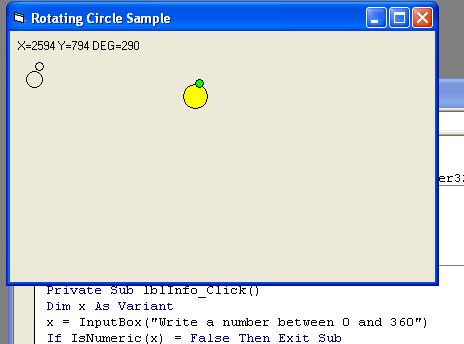



## A 360 Rotating Sample

### Description

rotating players in 2d games? make clocks, rotate stuff in whole three hundred and sixty degrees :P .. rate it please ;) and ENJOY
 
### More Info
 

             |
---                |---
**Submitted On**   |2005-01-26 22:41:56
**By**             |[TJWeb](https://github.com/Planet-Source-Code/PSCIndex/blob/master/ByAuthor/tjweb.md)
**Level**          |Beginner
**User Rating**    |5.0 (30 globes from 6 users)
**Compatibility**  |VB 6\.0
**Category**       |[Games](https://github.com/Planet-Source-Code/PSCIndex/blob/master/ByCategory/games__1-38.md)
**World**          |[Visual Basic](https://github.com/Planet-Source-Code/PSCIndex/blob/master/ByWorld/visual-basic.md)
**Archive File**   |[A\_360\_Rota184902262005\.zip](https://github.com/Planet-Source-Code/tjweb-a-360-rotating-sample__1-58727/archive/master.zip)

